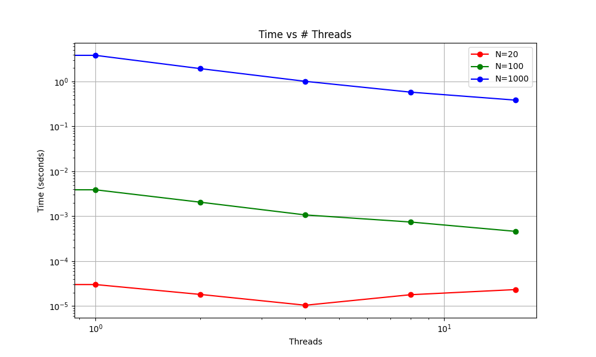
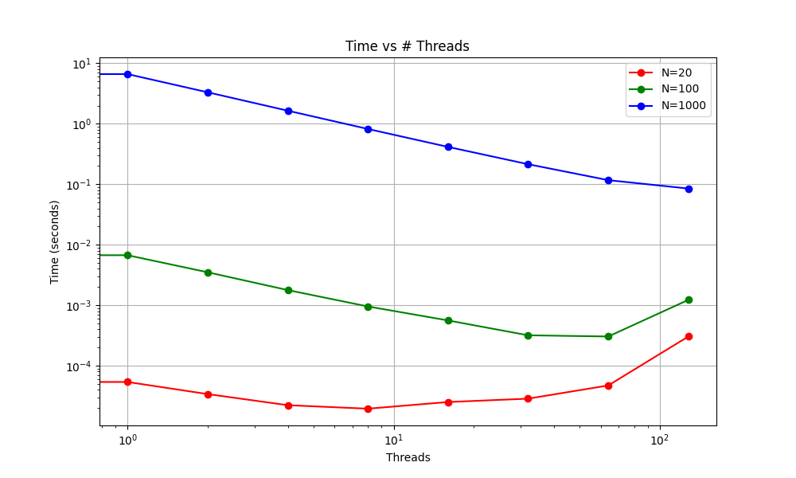

## Part 1

### 1.1

The code for part 1 can be found in part1_no_omp.cpp (no open mp) and part1.cpp (has open mp). They are compiled with 'g++ -o part1_no_omp.out part1_no_omp.cpp' and 'g++ -o part1.out part1.cpp -fopenmp'. Note, part1.cpp takes in # threads as an argumens, ex: './part1.out 10' will use 10 threads.

### 1.2

Here are the results for no threads vs one thread, matrix size 100:

No threads: 0.00520065
One thread: 0.00672881

This behavior is as we expected, as we believe that OpenMP will have a little extra overhead cost from sertting up the thread, making it slightly slower.

### 1.3

The times-to-solution vs threads graphs can be found below, in part 1.4. Both Thad's desktop and the HPCC were tested (see Part1Data/ and Part1Data/HPCCData/), and both have similar results. All three N sizes of matrices see speedups as the first few threads are added, which follows an ideal linear scaling. After a certain # of threads, the time deviates from the linear scaling, becoming slower. This is seen for N=20 on Thad's desktop and for all three sizes on the HPCC. Thad's desktop doesn't support enough threads for the timings of N=100, and N=1000 to have a significant difference. This slowdown occurs due to the overhead of using that many threads costing more than it would to simply use less threads. Focusing on the results from the HPCC, it appears that when the number of threads approach half of the matrix size is when the time taken starts to increase. 

### 1.4

Scaling and speedup discussed above, figures are below.

First up is the results from testing 1-16 threads on Thad's desktop:


Now here is the results from testing on the HPCC:


### 1.5
There is a commented out section that tests this directly after multiplication. We tested this on matrices of size 20-2000, and there were no issues. We did have errors when collapsing inner loops due to race conditions/false sharing. While reordering the loops + collapsing two is fine, we left it with just the outer loop as the problem intended. This section is currently commented out to reduce the time spent on repeated tests on the HPCC (verifying random matrices is slow for large matrices).

## Part 2

Here is the output of the hello world model with 4 threads and 2 MPI processes. The code for this part is in `part-2/hello.cpp`.
```
Before MPI
Before MPI
Node: 0 out of 2, thread 0
Rank 0 of : 2 nodes
Node: 0 out of 2, thread 2
Rank 0 of : 2 nodes
Node: 0 out of 2, thread 1
Rank 0 of : 2 nodes
Node: 0 out of 2, thread 3
Rank 0 of : 2 nodes
Node: 1 out of 2, thread 0
Node: 1 out of 2, thread 3
Node: 1 out of 2, thread 1
Node: 1 out of 2, thread 2
After MPI
After MPI
```
First of all we can see that `Before MPI` and `After MPI` is printed twice showing the two mpi processes. As we can see there are 4 prints with rank 0. This shows that the print statement is ran with four threads in the rank 0 process. If we take a close look at the results, we can see that the threads don't have any specific order which is expected.

## Part 3


