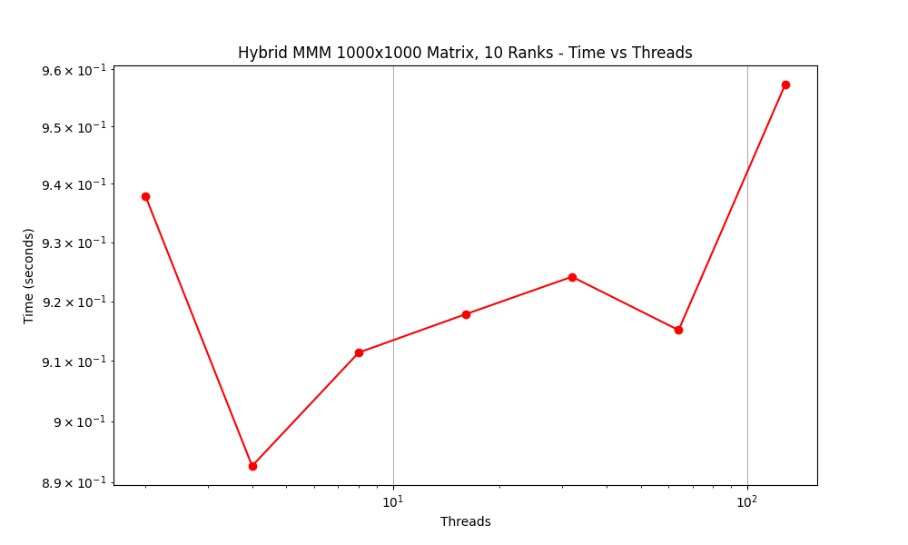

## Part 1

### 1.1

The code for part 1 can be found in part1_no_omp.cpp (no open mp) and part1.cpp (has open mp). They are compiled with 'g++ -o part1_no_omp.out part1_no_omp.cpp' and 'g++ -o part1.out part1.cpp -fopenmp'. Note, part1.cpp takes in # threads as an argumens, ex: './part1.out 10' will use 10 threads.

### 1.2

Here are the results for no threads vs one thread, matrix size 100:

No threads: 0.00520065
One thread: 0.00672881

This behavior is as we expected, as we believe that OpenMP will have a little extra overhead cost from sertting up the thread, making it slightly slower.

### 1.3

The times-to-solution vs threads graphs can be found below, in part 1.4. Both Thad's desktop and the HPCC were tested (see Part1Data/ and Part1Data/HPCCData/), and both have similar results. All three N sizes of matrices see speedups as the first few threads are added, which follows an ideal linear scaling. After a certain # of threads, the time deviates from the linear scaling, becoming slower. This is seen for N=20 on Thad's desktop and for all three sizes on the HPCC. Thad's desktop doesn't support enough threads for the timings of N=100, and N=1000 to have a significant difference. This slowdown occurs due to the overhead of using that many threads costing more than it would to simply use less threads. Focusing on the results from the HPCC, it appears that when the number of threads approach half of the matrix size is when the time taken starts to increase. 

### 1.4

Scaling and speedup discussed above, figures are below.

First up is the results from testing 1-16 threads on Thad's desktop:


Now here is the results from testing on the HPCC:


### 1.5
There is a commented out section that tests this directly after multiplication. We tested this on matrices of size 20-2000, and there were no issues. We did have errors when collapsing inner loops due to race conditions/false sharing. While reordering the loops + collapsing two is fine, we left it with just the outer loop as the problem intended. This section is currently commented out to reduce the time spent on repeated tests on the HPCC (verifying random matrices is slow for large matrices).

## Part 2

Here is the output of the hello world model with 4 threads and 2 MPI processes. The code for this part is in `part-2/hello.cpp`.
```
Before MPI
Before MPI
Node: 0 out of 2, thread 0
Rank 0 of : 2 nodes
Node: 0 out of 2, thread 2
Rank 0 of : 2 nodes
Node: 0 out of 2, thread 1
Rank 0 of : 2 nodes
Node: 0 out of 2, thread 3
Rank 0 of : 2 nodes
Node: 1 out of 2, thread 0
Node: 1 out of 2, thread 3
Node: 1 out of 2, thread 1
Node: 1 out of 2, thread 2
After MPI
After MPI
```
First of all we can see that `Before MPI` and `After MPI` is printed twice showing the two mpi processes. As we can see there are 4 prints with rank 0. This shows that the print statement is ran with four threads in the rank 0 process. If we take a close look at the results, we can see that the threads don't have any specific order which is expected.

## Part 3
### Code Location
The code for part 3 is located in the `part-3` folder and the main code is in the `part3.cpp` file.  

### Algorithm
The algorithm for the hybrid matrix-matrix multiplication is to first designate the rank 0 MPI process as the leader node that will control everything.  First the leader sends the Matrix B to all of its follower processes.  Then the leader will split up the A process into its rows and divy them up amongst the followers.  Each follower will then multiply that row by its copy of matrix B in row-matrix multiplication.  

The leader marks each follower as busy with a row index, and once it changes back to free it sends another row to the followers in a round-robin format to free mpi processes.

### Results
We preformed 3 different performances studies in which we varied the number of MPI ranks, number of OpenMP threads per rank, and the matrix size.  In each of these test we only changed one of the variables while keeping the other 2 variables the same.

The graph below shows the results of varying up the number of MPI ranks in the hybrid matrix-matrix multiplcation for a 1000x1000 sized matrix.  The number of ranks used were {2, 4, 8, 16, 32}.  Also in this graph the number of threads per rank was also changed to see if there was a difference.


The graph below shows the results of varying the size of the matrix while keeping the number of MPI ranks and threads per rank the same.  The sizes used were N = {20, 100, 250, 500, 1000, 1500, 2000} to get a good variety of sizes.  Each test ran with 10 MPI ranks with 10 threads each.


Shown below is the results of changing the number of threads per rank.  Each test ran with 10 MPI ranks on a matrix of size 1000X1000.  



### Analysis
#### Differing Ranks
As we change number of MPI ranks the program is allowed to use, we can see that the time to compute the matrix-matrix calculation steadily goes down.  there is a slight increase in computation time between 16 ranks and 32 ranks.

The SLURM config used for this (located in `part-3/jobpart3ranks.sb`) calls for 16 nodes so it makes sense that have increased MPI ranks would allow for better times over multiple nodes.
#### Differing Size
Predictably, as we increase the size of the matrix the time to complete the matrix-matrix multiplication also increases with it.  We see that the graph is relatively flat until the matrix size starts to reach 500x500.  


The SLURM config for these test (located in `part-3/jobpart3size.sb`) calls for 5 nodes, with 10 Ranks and 10 threads each.  The sharp increase could be explained by more cache lines needed to store each matrix increasing the bandwidth requirements throughout the nodes.
#### Differing Threads
The SLURM config used (located in `part-3/jobpart3threads.sb`) calls for 10 nodes with 1 task each and 10 threads per task.

When differing the amount of threads used by the program, the times reported were relatively close to one another.  This makes the graph look particularly erratic when really it looks like a flat line.  This suggests that the way that the hybrid matrix-matrix multiplication is set up favors having more MPI ranks and the number of threads isn't as important.  This could be because the program is limited by the bandwidth and thus it is irrelvant how fast the follower processes can complete their row-multiplication with the given threads.